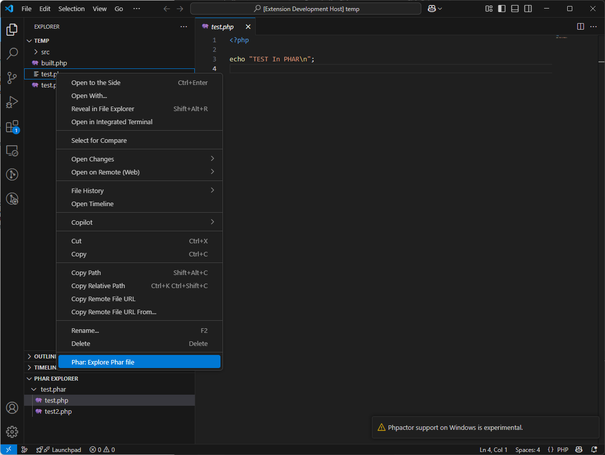

# vscode-phar

A VSCode extension to view contents of PHP Archive (PHAR) files

## Features

### Explore Phar file

1. Right click on a Phar file (.phar) and select `Phar: Explore Phar file`
2. Browse the contents of the Phar file under `Phar explorer` tree view
3. Click each file to open file from within Phar file
4. Close the Phar file with from `Phar explorer` tree view

## Known Issues

Since the current code loads the whole PHAR file it is terribly slow for larger files.

## Notes

PHAR code forked from https://github.com/ScerIO/phar.js
